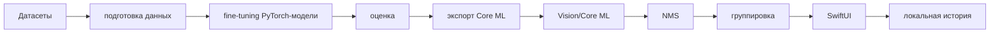

# Object Lens

Локальное iPhone-приложение для распознавания продуктов и бытовых предметов в реальном времени. Основной метод — многоклассовая object detection, затем NMS, группировка соседних объектов одного класса и SwiftUI-оверлей.



## Требования
Windows: Python 3.11/3.12, NVIDIA CUDA PyTorch, RTX 3050 4 ГБ. macOS: Xcode, Swift, Python 3.11/3.12, coremltools. В текущем контейнере проверены Python 3.12.13 и Swift 6.1.3; Xcode/macOS SDK отсутствуют, поэтому iOS-сборка здесь не выполнялась.

## Быстрый старт Windows
```powershell
.\scripts\setup_windows.ps1
python scripts/download_datasets.py
python scripts/prepare_dataset.py
python scripts/benchmark.py
python scripts/train.py
python scripts/evaluate.py
```

## Быстрый старт macOS
```bash
bash scripts/setup_macos.sh
python scripts/export_coreml.py
python scripts/validate_coreml.py
cp -R artifacts/coreml/ObjectLensDetector.mlpackage ios/ObjectLens/ObjectLens/Resources/
open ios/ObjectLens/ObjectLens.xcodeproj
```

## Структура
`configs` — классы и пороги, `scripts` — pipeline, `src/object_recognition` — Python-библиотека, `tests` — pytest, `ios/ObjectLens` — SwiftUI-приложение, `artifacts` — отчёты и модели.

## Ограничения
Большие датасеты и обученные веса не входят в Git. Реальные mAP, latency и FPS появляются только после запуска benchmark, обучения, Core ML-валидации и теста на физическом iPhone.


## Одна кнопка запуска на Windows

Для максимально простого старта откройте PowerShell в корне репозитория и запустите один файл:

```powershell
.\scripts\one_click_windows.ps1
```

Скрипт сам создаёт `.venv`, ставит зависимости, скачивает маленький проверочный датасет COCO8 по ссылке, создаёт структуру данных, запускает тесты и benchmark. Это быстрый smoke-test, чтобы убедиться, что проект запускается без ручной установки датасета.

Для реального обучения на ваших классах запустите тот же файл с флагом `-RealDataset`. Он сам поставит FiftyOne и скачает Open Images:

```powershell
.\scripts\one_click_windows.ps1 -RealDataset
python scripts/train.py
```

Если нужно ограничить размер первой загрузки, задайте лимит:

```powershell
.\scripts\one_click_windows.ps1 -RealDataset -MaxSamplesPerSplit 200
```

Open Images скачивается локально в `data/raw`, а подготовленные данные кладутся в `data/processed`. Ничего из этих папок не надо пушить в GitHub.

## Как запушить этот проект в свой GitHub

Если репозиторий уже привязан к вашему GitHub remote, выполните:

```bash
git status
git branch --show-current
git push -u origin $(git branch --show-current)
```

Если remote ещё не добавлен:

```bash
git remote add origin https://github.com/<your-user>/<your-repo>.git
git push -u origin $(git branch --show-current)
```

Если GitHub просит пароль, используйте Personal Access Token вместо пароля. Для приватного репозитория это нормально; датасеты и веса всё равно не надо коммитить.

## Что сейчас нужно от пользователя

Мне не нужно, чтобы вы загружали сюда весь датасет. Большие датасеты обычно занимают десятки или сотни гигабайт, их нельзя удобно и правильно передавать через чат или хранить в Git. Правильный процесс такой:

1. Запушьте код в свой GitHub по командам выше.
2. На Windows-ПК с RTX 3050 скачайте датасеты локально в папку `data/raw` командами проекта.
3. Подготовьте единый YOLO-набор в `data/processed/yolo`.
4. Запустите короткий benchmark и обучение.
5. После обучения перенесите только лучший checkpoint, например `artifacts/checkpoints/best.pt`, на MacBook.
6. На MacBook экспортируйте checkpoint в Core ML `.mlpackage`.
7. Добавьте `.mlpackage` в Xcode-проект и установите приложение на iPhone.

Передавать мне файлы нужно только если возникнет ошибка. В таком случае пришлите:

- текст команды, которую запускали;
- полный текст ошибки;
- файл конфигурации, который меняли;
- небольшой фрагмент структуры папок через `tree -L 3` или аналог;
- при проблеме с датасетом — 1–3 маленьких примера аннотаций и имена соответствующих изображений, но не весь датасет.

## Минимальный следующий шаг без датасета

Сначала проверьте, что окружение запускается:

```bash
python -m venv .venv
source .venv/bin/activate
pip install -U pip
pip install -r requirements-lock.txt
pytest -q
python scripts/prepare_dataset.py
python scripts/benchmark.py
```

На Windows PowerShell используйте:

```powershell
.\scripts\setup_windows.ps1
pytest -q
python scripts/prepare_dataset.py
python scripts/benchmark.py
```

Если эти команды проходят, дальше переходите к скачиванию COCO/Open Images согласно `DATASETS.md`.

## Что делать с датасетами

Для первой рабочей версии не пытайтесь сразу собрать идеальные данные для всех 50+ классов. Практичнее начать с COCO/Open Images классов с хорошими bounding boxes:

- apple;
- banana;
- orange;
- carrot;
- broccoli;
- bottle;
- cup;
- bowl;
- fork;
- spoon;
- knife;
- book;
- laptop;
- keyboard;
- mouse;
- backpack;
- handbag;
- clock.

После первого успешного обучения расширяйте набор классами из Open Images и специализированных датасетов. Если какой-то класс имеет мало качественных рамок, лучше временно исключить его из обучения, чем портить качество всей модели шумной разметкой.

## Что мне понадобится от вас на следующем шаге

Когда вы запустите проект локально, пришлите один из вариантов:

### Если всё установилось

Пришлите вывод:

```bash
pytest -q
python scripts/benchmark.py
```

И напишите, на какой машине запускали: Windows RTX 3050 или MacBook M2.

### Если упало скачивание или подготовка данных

Пришлите:

```bash
python --version
pip list
python scripts/download_datasets.py
python scripts/prepare_dataset.py
```

А также полный traceback ошибки.

### Если обучение запустилось

Пришлите первые 30–50 строк лога обучения и последние 30–50 строк лога. Весь датасет присылать не нужно.
